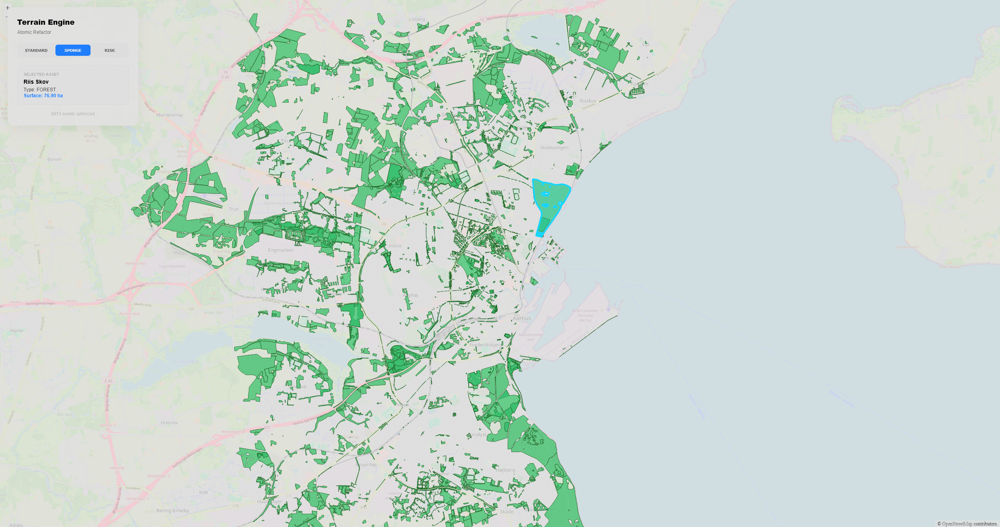

# Scalgo Engine Prototype - Aarhus Green Infrastructure

This project is a high-performance GIS web application. It analyzes and visualizes the green infrastructure of Aarhus, Denmark, focusing on water management and urban resilience.

## Key Features

- **Nature Restoration Simulation**: A "Sponge City" mode that visualizes the potential for increased water infiltration.
- **Flood Risk Analysis**: A dynamic "Risk Mode" that categorizes green assets based on their surface area to identify critical flood mitigation priorities.
- **Atomic Architecture**: Fully refactored into atomic React components and custom hooks (`useMap`) for maximum maintainability.

## 🛠 Technical Stack

- **React 18** with **TypeScript**
- **OpenLayers**: Advanced geospatial engine.
- **Overpass API**: Data sourced from OpenStreetMap for Aarhus city.

## Performance Optimizations

To ensure a smooth experience with over 1,000 complex polygons, the following strategies were implemented:

- **Geometry Simplification**: Reducing vertex count via Douglas-Peucker algorithm to offload the CPU.
- **Spatial Indexing**: Enabled `useSpatialIndex` for O(log n) feature detection.
- **Style Caching**: Memoized styles to prevent memory churn during re-renders.
- **Atomic State Sync**: Decoupled map logic from React's render cycle using `useRef` and `useCallback`.

## Future Scaling (Production Grade)

For larger datasets (100k+ features), the roadmap includes:

1. Migration to **Vector Tiles (MVT)** for tiled data loading.
2. Implementing **WebGLVectorLayer** to leverage GPU-accelerated rendering.
